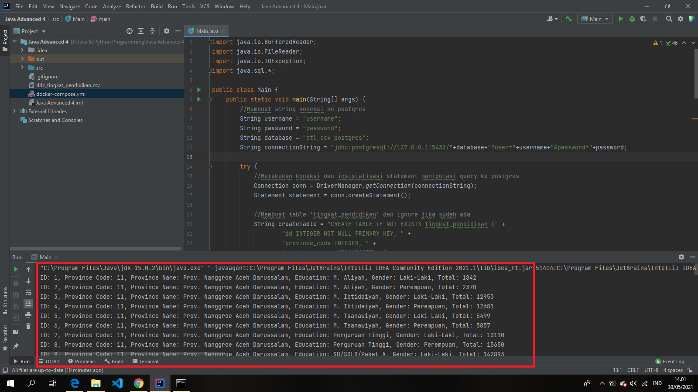

# ETL Process CSV File to Postgres Database

## CSV Data
- url:  ```https://github.com/aswansyahputra/nusandata/blob/master/data-raw/pendidikan/ddk_tingkat_pendidikan.csv```

## Requirements
- Docker
- Intellij IDEA

## How to Run
- build docker image dengan command  `docker-compose -f docker-compose.yml build`
- jalankan server postgres dengan command  `docker-compose -f docker-compose.yml up`
- matikan server postgres dengan command  `docker-compose -f docker-compose.yml down`

## Sample Output

